<p align="center">
  <br>
  
</p>

```
  ███████╗██╗   ██╗██╗██╗  ██╗ █████╗    ██╗  ██╗██╗   ██╗██████╗ 
  ██╔════╝██║   ██║██║██║ ██╔╝██╔══██╗   ██║  ██║██║   ██║██╔══██╗
  ███████╗██║   ██║██║█████╔╝ ███████║   ███████║██║   ██║██████╔╝
  ╚════██║██║   ██║██║██╔═██╗ ██╔══██║   ██╔══██║██║   ██║██╔══██╗
  ███████║╚██████╔╝██║██║  ██╗██║  ██║   ██║  ██║╚██████╔╝██████╔╝
  ╚══════╝ ╚═════╝ ╚═╝╚═╝  ╚═╝╚═╝  ╚═╝   ╚═╝  ╚═╝ ╚═════╝ ╚═════╝
          🔍 AI-Powered Security Scanner & Reconnaissance Framework
```

<p align="center">
  <a href="https://pypi.org/project/suika-hub/"></a>
  <a href="https://www.python.org/downloads/"></a>
  <a href="LICENSE"></a>
  <a href="#"></a>
  <a href="#"></a>
  <a href="https://openai.com"></a>
  <a href="#"></a>
  <a href="https://twitter.com/suikahub"></a>
</p>

---

**suika-hub** is an AI-powered, modular security reconnaissance and vulnerability scanning framework. It orchestrates 50+ security tools through a unified CLI, uses **OpenAI GPT models** for intelligent finding analysis, and produces actionable reports in JSON, SARIF, and HTML formats.

> *"Suika" (西瓜) is Japanese for watermelon — sweet on the outside, packed with juicy findings on the inside.* 🍉

---

## ⚡ Quick Start

```bash
# Install
pip install suika-hub

# One-liner: full recon + AI analysis on a target
suika scan example.com --all --ai-report --output report.html

# Or use the modular CLI
suika recon example.com          # Subdomain enum, port scan, tech detection
suika vuln example.com           # Nuclei + custom vulnerability checks
suika report ./findings/ --sarif # Generate SARIF for GitHub Security tab
```

**Set your OpenAI key for AI-powered analysis:**
```bash
export OPENAI_API_KEY="sk-..."
suika scan example.com --ai-explain  # GPT explains each finding + remediation
```

---

## 🏗️ Architecture

```mermaid
graph TB
    CLI["🖥️ suika CLI"] --> CORE["⚙️ Core Engine"]
    CORE --> RECON["🔍 Recon Modules"]
    CORE --> VULN["🛡️ Vuln Scanners"]
    CORE --> AI["🤖 AI Analyzer<br>(OpenAI GPT)"]
    CORE --> REPORT["📊 Report Engine"]
    CORE --> PLUGIN["🔌 Plugin System"]

    RECON --> |"subfinder, amass, dnsx"| SUBS["Subdomain Enum"]
    RECON --> |"nmap, masscan, rustscan"| PORTS["Port Scanning"]
    RECON --> |"katana, hakrawler"| CRAWL["Web Crawling"]
    RECON --> |"httpx, whatweb"| TECH["Tech Detection"]
    RECON --> |"gau, waybackurls"| ARCHIVE["URL Mining"]

    VULN --> |"nuclei, jaeles"| TEMPLATES["Template Scanning"]
    VULN --> |"sqlmap, dalfox"| INJECT["Injection Testing"]
    VULN --> |"sslscan, testssl"| SSL["SSL/TLS Analysis"]
    VULN --> |"nikto, wpscan"| WEB["Web Vuln Scanning"]
    VULN --> |"trufflehog, js_analyzer"| SECRETS["Secret Detection"]

    AI --> |"GPT-4 Analysis"| EXPLAIN["Finding Explanation"]
    AI --> |"Risk Scoring"| SEVERITY["CVSS Enhancement"]
    AI --> |"Auto Remediation"| FIX["Fix Suggestions"]

    REPORT --> JSON["📄 JSON Output"]
    REPORT --> SARIF["📋 SARIF Output"]
    REPORT --> HTML["🌐 HTML Report"]
    REPORT --> MD["📝 Markdown"]

    PLUGIN --> CUSTOM["Custom Modules"]
    PLUGIN --> COMMUNITY["Community Plugins"]
    PLUGIN --> CHROME["🌐 Chrome Extension"]
```



**Data Flow:**
```
Target Input → Recon Phase → Vuln Scan Phase → AI Analysis → Report Generation
     │              │              │                │              │
     └── Cache ─────┘──────────────┘────────────────┘──────────────┘
                    (SQLite-backed deduplication & state persistence)
```

---

## 🚀 Features

| Feature | Description |
|---------|-------------|
| 🤖 **AI-Powered Analysis** | OpenAI GPT-4 integration for finding explanation, risk scoring, and remediation suggestions |
| 🔍 **50+ Tool Orchestration** | Unified CLI wrapping nmap, nuclei, subfinder, httpx, sqlmap, dalfox, and many more |
| 📊 **Multi-Format Reports** | JSON, SARIF (GitHub Security tab), HTML (interactive), Markdown |
| 🌐 **Chrome Extension** | Real-time vulnerability indicators while browsing target sites |
| 🔌 **Plugin System** | Write custom scan modules in Python, register via entry points |
| 🎯 **Smart Targeting** | Batch scan from file, wildcard support, scope enforcement |
| 💾 **State Persistence** | SQLite-backed scan state — resume interrupted scans |
| 🧩 **Modular Design** | Run individual modules or full pipelines |
| 🔐 **Credential Management** | Encrypted API key storage for Shodan, Censys, OpenAI, etc. |
| 📦 **Docker Support** | Pre-built image with all tools installed |
| 🧪 **CI/CD Ready** | SARIF output integrates directly with GitHub Actions Security tab |
| 🌍 **WAF Bypass** | DNS history lookup, proxy rotation, header manipulation |

---

## 📦 Installation

### pip (recommended)
```bash
pip install suika-hub
```

### With all optional dependencies
```bash
pip install suika-hub[full]
```

### Docker
```bash
docker pull ghcr.io/suika-hub/suika-hub:latest
docker run --rm -v $(pwd)/reports:/reports ghcr.io/suika-hub/suika-hub scan example.com --output /reports/
```

### From source
```bash
git clone https://github.com/suika-hub/suika-hub.git
cd suika-hub
pip install -e ".[dev]"
```

---

## 📖 Module Documentation

### 🔍 Recon Module — `suika recon`

Subdomain enumeration, port scanning, tech fingerprinting, and URL discovery.

```bash
# Full recon pipeline
suika recon example.com --full

# Subdomain enumeration only
suika recon example.com --subs

# Port scan with service detection
suika recon 192.168.1.0/24 --ports --top-ports 1000

# Tech stack detection
suika recon https://example.com --tech

# Historical URL discovery
suika recon example.com --urls --archive
```

**Under the hood:** `subfinder`, `amass`, `dnsx` for subs; `nmap`, `masscan`, `rustscan` for ports; `httpx`, `whatweb` for tech; `gau`, `waybackurls` for archives.

### 🛡️ Vuln Module — `suika vuln`

Vulnerability scanning with template-based and dynamic approaches.

```bash
# Full vulnerability scan
suika vuln example.com --all

# SQL injection testing
suika vuln example.com --sqli

# XSS scanning
suika vuln example.com --xss

# SSL/TLS analysis
suika vuln example.com --ssl

# Template scanning (Nuclei)
suika vuln example.com --templates critical,high

# Secret detection in JS bundles
suika vuln https://example.com --secrets

# Race condition testing
suika vuln https://example.com/app --race --concurrency 50
```

### 🤖 AI Module — `suika ai`

OpenAI-powered analysis of scan results.

```bash
# Explain all findings with GPT-4
suika ai explain ./findings.json

# Generate remediation plan
suika ai remediate ./findings.json --priority

# Risk re-scoring with AI context
suika ai score ./findings.json --cvss-enhance

# Custom analysis prompt
suika ai analyze ./findings.json --prompt "Focus on OWASP Top 10 for e-commerce"
```

**How it works:**
1. Scan findings are serialized and sent to the OpenAI API
2. GPT-4 analyzes each finding in context of the target technology stack
3. Returns human-readable explanations, enhanced CVSS scores, and specific fix recommendations
4. Results are cached locally to minimize API calls

### 📊 Report Module — `suika report`

Generate professional reports from scan data.

```bash
# JSON report (default)
suika report ./findings/ --format json

# SARIF for GitHub Security tab
suika report ./findings/ --format sarif --output results.sarif

# Interactive HTML report
suika report ./findings/ --format html --output report.html --ai-summary

# Markdown for documentation
suika report ./findings/ --format markdown
```

### 🔎 Specific Tool Wrappers

```bash
# Subdomain enumeration
suika subfinder example.com
suika amass example.com --passive
suika massdns example.com --brute

# Port scanning
suika nmap 192.168.1.1 -sV -sC
suika masscan 10.0.0.0/8 --ports 1-65535 --rate 10000
suika rustscan 192.168.1.1 --top-ports 1000

# Web scanning
suika nuclei example.com --severity critical,high
suika nikto example.com
suika wpscan https://example.com --enumerate vp,vt,u

# Injection testing
suika sqlmap "https://example.com/page?id=1" --level 3 --risk 2
suika dalfox "https://example.com/search?q=FUZZ"
suika nosqlmap "https://example.com/api/login"

# OSINT
suika shodan "apache country:ID"
suika trufflehog https://github.com/target/repo
suika recon-ng --workspace default --module brute_hosts

# Binary analysis
suika checksec ./binary
suika strings ./binary --min-length 8
suika binwalk firmware.bin
```

---

## 🔌 Plugin System

suika-hub supports custom plugins via Python entry points.

### Creating a Plugin

```python
# my_plugin.py
from suika_hub.core import BaseScanner, Finding

class CustomScanner(BaseScanner):
    name = "my-custom-scanner"
    description = "Checks for custom misconfigurations"
    severity = "medium"

    def scan(self, target: str, **kwargs) -> list[Finding]:
        findings = []
        # Your custom logic here
        response = self.http_get(f"https://{target}/.well-known/security.txt")
        if response.status_code != 200:
            findings.append(Finding(
                title="Missing security.txt",
                severity="info",
                description="No security.txt found at well-known path",
                target=target,
                remediation="Add a security.txt file per RFC 9116",
            ))
        return findings
```

### Registering via Entry Points

```toml
# pyproject.toml
[project.entry-points."suika_hub.plugins"]
my_scanner = "my_package.scanners:CustomScanner"
```

```bash
pip install -e .
suika plugins list          # See registered plugins
suika scan example.com --plugin my-custom-scanner
```

### Community Plugins

| Plugin | Description |
|--------|-------------|
| `suika-cloud` | AWS/Azure/GCP misconfiguration scanning |
| `suika-mobile` | Mobile app (APK/IPA) security analysis |
| `suika-api` | REST/GraphQL API fuzzing suite |
| `suika-ioc` | IOC extraction and threat intel lookup |

---

## 📄 Output Formats

### JSON (default)
```json
{
  "scan_id": "a1b2c3d4",
  "target": "example.com",
  "timestamp": "2025-01-15T10:30:00Z",
  "summary": {
    "total_findings": 12,
    "critical": 1,
    "high": 3,
    "medium": 5,
    "low": 2,
    "info": 1
  },
  "findings": [
    {
      "id": "VULN-001",
      "title": "SQL Injection in /api/search",
      "severity": "critical",
      "cvss": 9.8,
      "target": "https://example.com/api/search",
      "description": "Parameter 'q' is vulnerable to time-based blind SQL injection",
      "evidence": "Response delayed 5.2s with payload: q=1' AND SLEEP(5)--",
      "tool": "sqlmap",
      "ai_analysis": "This is a critical SQL injection in a search endpoint that likely has access to the full database. The time-based blind vector suggests WAF bypass is possible with alternative encodings.",
      "remediation": "Use parameterized queries. Implement input validation. Deploy WAF rules for SQL keywords.",
      "references": ["https://cwe.mitre.org/data/definitions/89.html"],
      "cwe": "CWE-89"
    }
  ]
}
```

### SARIF (GitHub Security Tab)
```json
{
  "$schema": "https://raw.githubusercontent.com/oasis-tcs/sarif-spec/master/Schemata/sarif-schema-2.1.0.json",
  "version": "2.1.0",
  "runs": [{
    "tool": {
      "driver": {
        "name": "suika-hub",
        "version": "1.0.0",
        "informationUri": "https://github.com/suika-hub/suika-hub",
        "rules": [
          {
            "id": "VULN-001",
            "name": "SQLInjection",
            "shortDescription": { "text": "SQL Injection in /api/search" },
            "defaultConfiguration": { "level": "error" }
          }
        ]
      }
    },
    "results": [...]
  }]
}
```

### HTML Report
Interactive dashboard with severity charts, finding details, AI explanations, and exportable sections. Open `report.html` in any browser — no server needed.

```
suika report ./findings/ --format html --output report.html --ai-summary
# Generates a self-contained HTML file with Chart.js visualizations
```

---

## 🌐 Chrome Extension

Real-time security indicators while browsing target applications.

### Setup
```bash
# Install the extension
suika chrome install

# Or manually:
# 1. Open chrome://extensions
# 2. Enable "Developer mode"
# 3. Click "Load unpacked" → select suika_hub/chrome_extension/
```

### Features
- 🔴 Real-time passive vulnerability detection as you browse
- 🟡 Security header analysis (CSP, HSTS, X-Frame-Options)
- 🟢 Technology fingerprinting overlay
- 📋 One-click finding export to suika-hub CLI
- 🔗 Cookie/security flag inspection

### Usage
```bash
# Start the companion API server
suika chrome serve --port 9876

# Browse your target — findings appear in the extension popup
# Export to CLI: click "Send to suika-hub" in extension popup
```

---

## ⚙️ Configuration

```yaml
# ~/.suika-hub/config.yaml
openai:
  model: "gpt-4-turbo"
  max_tokens: 4096
  cache_results: true

scanning:
  threads: 10
  timeout: 30
  rate_limit: 100  # requests/sec
  user_agent: "suika-hub/1.0 (security-scan)"

output:
  format: "json"
  directory: "./reports"
  auto_sarif: true

tools:
  nmap:
    args: "-sV -sC --script=default"
  nuclei:
    severity: "critical,high,medium"
  subfinder:
    sources: "all"

plugins:
  enabled: true
  directory: "~/.suika-hub/plugins"
```

---

## 🐳 Docker

```bash
# Build
docker build -t suika-hub .

# Run scan
docker run --rm \
  -e OPENAI_API_KEY=$OPENAI_API_KEY \
  -v $(pwd)/reports:/reports \
  suika-hub scan example.com --all --output /reports/

# Docker Compose (with companion services)
docker-compose up
```

---

## 🧪 Testing

```bash
# Unit tests
pytest tests/ -v

# Integration tests (requires target)
pytest tests/integration/ -v --target example.com

# Coverage
pytest --cov=suika_hub --cov-report=html
```

---

## 📋 Examples

### Bug Bounty Workflow
```bash
# 1. Full recon
suika recon target.com --full -o recon.json

# 2. Vulnerability scan on discovered assets
suika vuln --input recon.json --all -o vulns.json

# 3. AI analysis
suika ai explain vulns.json --model gpt-4

# 4. Generate report
suika report ./findings/ --format html --ai-summary --output bounty-report.html
```

### CI/CD Integration
```yaml
# .github/workflows/security.yml
name: Security Scan
on: [push, pull_request]
jobs:
  scan:
    runs-on: ubuntu-latest
    steps:
      - uses: actions/checkout@v4
      - run: pip install suika-hub
      - run: suika scan ${{ github.event.repository.name }} --all --sarif --output results.sarif
      - uses: github/codeql-action/upload-sarif@v3
        with:
          sarif_file: results.sarif
```

### Batch Scanning
```bash
# Scan multiple targets
cat targets.txt | suika scan --batch --ai-report

# targets.txt format:
# example.com
# api.example.com
# 192.168.1.0/24
```

---

## 🤝 Contributing

We welcome contributions! Please see [CONTRIBUTING.md](CONTRIBUTING.md) for guidelines.

```bash
# Quick start for contributors
git clone https://github.com/suika-hub/suika-hub.git
cd suika-hub
pip install -e ".[dev]"
pre-commit install
pytest
```

---

## 📜 License

MIT License — see [LICENSE](LICENSE) for details.

---

## 🙏 Acknowledgments

Built on the shoulders of giants — suika-hub orchestrates tools from the incredible open-source security community:

[subfinder](https://github.com/projectdiscovery/subfinder) • [nuclei](https://github.com/projectdiscovery/nuclei) • [httpx](https://github.com/projectdiscovery/httpx) • [nmap](https://nmap.org) • [sqlmap](https://sqlmap.org) • [dalfox](https://github.com/hahwul/dalfox) • [trufflehog](https://github.com/trufflesecurity/trufflehog) • [masscan](https://github.com/robertdavidgraham/masscan) • and [50+ more](./docs/tools.md)

<p align="center">
  <a href="https://openai.com"></a>
</p>

<p align="center">
  <b>Made with 🍉 by the suika-hub community</b><br>
  <sub>If you find this useful, give us a ⭐ on GitHub!</sub>
</p>
